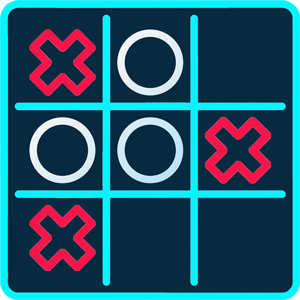
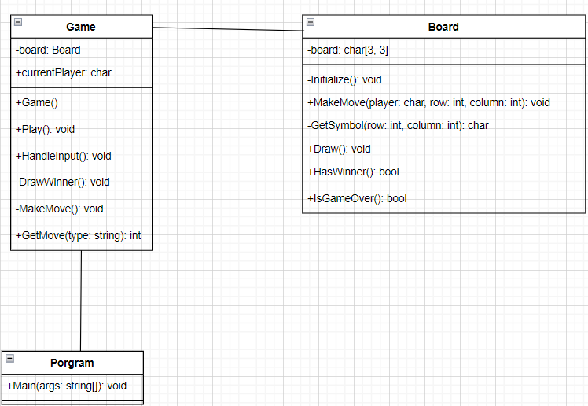
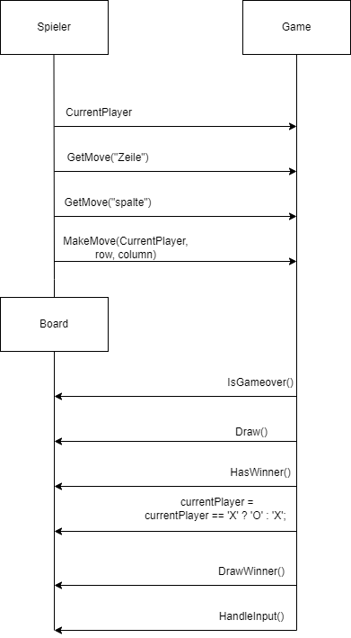
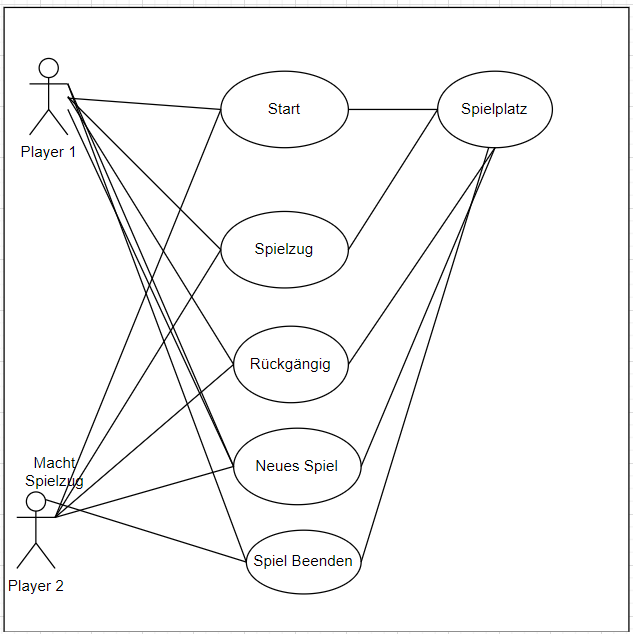

# Dokumentation TicTacToe Projekt V320

###### Livio Piccolotto, Thi Nguyen, Din Sabic

31.03.2023 Din, Thi, Livio

## Inhaltsverzeichnis

- [Einleitung](#Einleitung)
- [Hauptteil](#Hauptteil)
- [Sprints](#Sprints)
- [Testing](#Testing)
- [Verlinkung](#Verlinkung)
- [Diagramme](#Diagramme)
- [Quellverzeichniss](#Quellverzeichniss)

## Einleitung

Im Unterricht des Vertiefungsmoduls 320 haben wir einen Projektauftrag erhalten. Wir müssen ein TicTacToe-Spiel in C# programmieren. Das Ganze wurde in diesem Markdown-Dokument dokumentiert und mithilfe einer agilen Entwicklungsmethode in Azure DevOps entworfen und geplant. Das Projekt wurde in Teamarbeit von Thi Nguyen, Din Sabic und Livio Piccolott fertiggestellt.

Die Anforderungen für das Projekt waren:

- Zwei Spieler spielen auf einem 3x3 Feld
- Abwechselnde Eingabe des Kommandos
- Neues Spiel = "neu"
- Spiel beenden = "end"
- Spielzug rückgängig machen = "undo"

Erwartete Resultate:

Link zu Ihrem Azure DevOps-Projekt, Lehrperson in Projektteam aufnehmen. Es wird der komplette Projektablauf bewertet – nicht nur das Resultat.

- Protokoll zu Sprint-Review und Retrospektive (Daily-Scrum optional)
- UseCase-/System-Diagramm
- Klassendiagramm
- Sequenzdiagramm
- Dokumentation der Tests
- GitHub-Link zum Repository mit dem gesamten Projekt
- Programm dokumentiert mit C# XML-Dokumentation
- Unittests, welche die komplette Logik abdecken

## Hauptteil

### Sprints

###### Sprint 1

Sprintziel 14.03.2023:

Unser Ziel ist das Einrichten eines GitHub-Repositories sowie eines aufgeräumten und mit ersten User Stories versehenen Azure DevOps.

Sprint Review:

Wir haben es geschafft, in unserem ersten Sprint die User Stories zu schreiben sowie auch umzusetzen, unser Taskboard anzupassen und zu organisieren, die Produktvision zu definieren, die verschiedenen Diagramme zu gestalten und haben zudem, wie auch in den User Stories definiert, damit begonnen, den Code für das Grundgerüst des Spiels zu schreiben.

Retrospektive:

Wir denken, dass wir einiges besser hätten machen können. Das Hinzufügen von mehreren Funktionen wäre sinnvoller gewesen. Das nächste Mal werden wir uns auch besser mit den User Stories beschäftigen, da diese eine sehr wichtige Rolle im ganzen Prozess haben und zum Erfolg beitragen.

###### Sprint 2:

Sprintziel 21.03.2023:

Wir wollen funktionelle Methoden in unser TicTacToe-Spiel einbauen.

Sprint-Review:

Wir haben bereits begonnen, unsere Dokumentation zu schreiben und zu gliedern. Dann konnten wir eine Methode entwickeln, um Spielerzüge zu ermitteln, sowie eine Methode, um die Spielerabfolge zu wechseln. Allerdings haben wir dies in der Main-Methode gemacht, was nicht optimal ist.

Retrospektive:

Wir haben in unserem zweiten Sprint weniger erreicht als im ersten Sprint. Trotzdem haben wir eine gute Ordnerstruktur in GitHub aufgebaut, unsere Dokumentation begonnen zu schreiben und wir konnten einige Methoden in unser Spiel einbauen. Als Gruppe haben wir das Gefühl, dass wir konzentrierter arbeiten müssen, da sich dies in unserer Arbeit widerspiegelt.

###### Sprint 3:

Sprintziel 28.03.2023

Unser Ziel ist es, das Testing einzubauen, das Memento Pattern zu implementieren sowie den Code zu verfeinern.

Sprint-Review:

In diesem Sprint konnten wir verschiedene Testfälle erstellen und dokumentieren. Danach war die Gruppe damit beschäftigt, das Memento Pattern zu implementieren, was uns jedoch bis jetzt noch nicht gelungen ist. Den Code konnten wir erfolgreich kürzen und die XML-Dokumentation begonnen einzubauen.

Retrospektive:

Wir denken, dass wir in diesem Sprint gut vorangekommen sind. Obwohl wir nicht alles geschafft haben und große Probleme mit dem Memento Pattern hatten, konnten wir uns in der Gruppe klar verständigen, beschäftigen und zusammenarbeiten. Dies hat das Projekt produktiv vorangetrieben. Wir sind der Meinung, dass wir mehr Zeit in das Memento Pattern investieren sollten.

### Testing

###### Einführung

Das Ziel des Testings besteht darin, sicherzustellen, dass das TicTacToe-Spiel ordnungsgemäß funktioniert und alle Anforderungen erfüllt sind. Das Testkonzept umfasst die Testplanung, Teststrategie, Testmethoden und die Testdurchführung.

###### Testziele

Die folgenden Ziele hat das Testkonzept:

- Sicherstellen, dass alles ordnungsgemäß funktioniert
- Überprüfen, ob das Spiel den Anforderungen entspricht
- Identifizieren und Beheben von Fehlern und Problemen
- Überprüfen, ob die Funktionalität des Spiels gewährleistet ist.

###### Testplanung

Testobjekt:

Das Testobjekt ist das TicTacToe spiel.

###### Testumgebung

Die Testumgebung ist die Entwicklungsplattform Microsoft Visual Studio 2022

Testanforderungen:
Es muss den Folgenden Anforderungen standhalten:

- Das Spiel muss eine 3x3-Spielfeldmatrix enthalten.
- Das Spiel muss in der Lage sein, die Spielzüge von zwei Spielern aufzuzeichnen.
- Das Spiel muss in der Lage sein, zu überprüfen, ob ein Spieler gewonnen hat.
- Das Spiel muss in der Lage sein, zu überprüfen, ob das Spiel unentschieden endet.
- Das Spiel muss in der Lage sein, Fehlermeldungen anzuzeigen, wenn ein Spieler einen ungültigen Zug ausführt oder ein bereits besetztes Feld wählt.

###### Teststrategie

Korrigierter Text: Die Anforderungen werden mit den folgenden Teststrategien überprüft:

- Unittests: Diese dienen dazu, die korrekte Funktionalität einzelner Code-Teile zu überprüfen.
- Integrationstests: Diese Tests überprüfen, ob die einzelnen Komponenten des Spiels miteinander kommunizieren und funktionieren.
- Funktionstests: Diese Tests überprüfen, ob das Spiel den Anforderungen entspricht und ordnungsgemäß funktioniert.

###### Testmethoden

Unittests:

- InitializeBoardTest: Überprüft, ob das Spielbrett korrekt aufgebaut wurde.
- MakeMoveTest: Überprüft, ob die Spielzüge korrekt aufgezeichnet und ausgeführt wurden.
- HasWinnerTest: Überprüft, ob das Spiel den Gewinner korrekt erkennt.
- IsGameOverTest: Überprüft, ob das Spiel erkennt, wenn es zu einem Unentschieden kommt.

Integrationstests:

- CheckIntegrationTest: Überprüft, ob die verschiedenen Komponenten des Spiels korrekt miteinander kommunizieren.

Functional Test:

- GameFunctionalityTest: Überprüft, ob das Spiel den Anforderungen entspricht und ordnungsgemäß funktioniert.

###### Testdurchführung

Die Durchführung erfolgt durch den Entwickler. Alle Test's haben funktioniert und ein erfolgreiches Ergebniss gebracht.

### Verlinkung

GitHub: https://github.com/lilZ0MZ/TicTacToe
Azure DevOps: https://dev.azure.com/ThilNguyen/TicTacToe

### Diagramme

Die Diagramme konnten wir für unsere Planun wunderbar einsetzen. Die halfen uns dabei die verschiedenen Klassen welche es für das Projekt braucht herauszufinden. Zudem konnte man so die verschiedenen Relationen herausfinden.

###### Klassendiagramm

###### Sequenzdiagramm

###### UseCase Diagramm

## Quellverzeichniss

- _Microsoft_. (2023). Von https://www.google.com/url?sa=i&url=https%3A%2F%2Fwww.microsoft.com%2Fde-de%2Fp%2Ftic-tac-toe-master%2F9n7tjk3jkb0v&psig=AOvVaw2CkybvskulwUe9UQsoCV6-&ust=1680376256617000&source=images&cd=vfe&ved=0CBEQjhxqFwoTCKjJz8Dvhv4CFQAAAAAdAAAAABAE abgerufen
- Eigene Aufnahmen
